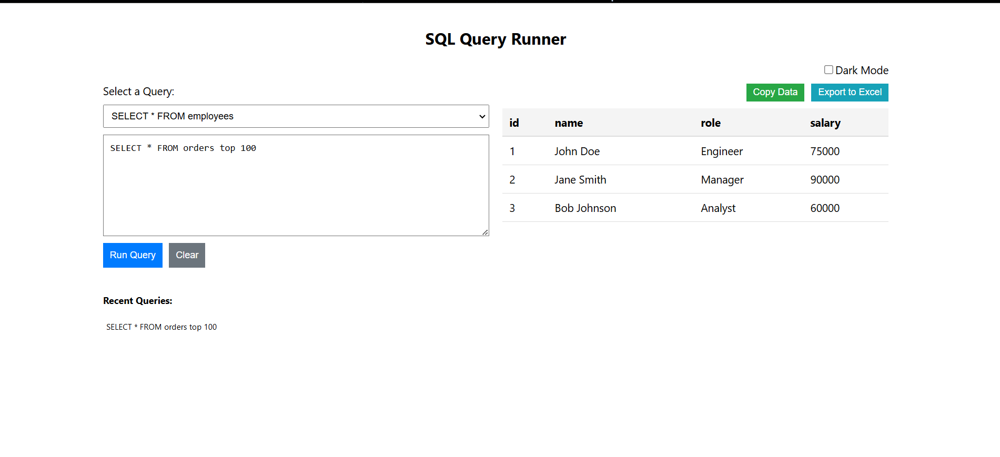
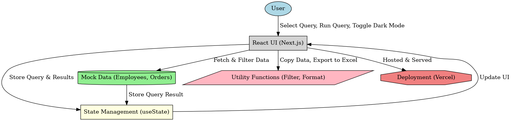

# Atlan-SQL-Runner-2025

A dummy SQL query runner application built for the Atlan Frontend Internship Task 2025. This project demonstrates a web-based interface for running mock SQL queries and displaying results, with a focus on usability for data analysts.

## Overview

This is a frontend-only React application that simulates a SQL query runner. It allows users to select predefined queries or type custom ones, displaying mock data in a table. The app includes features to enhance user experience, such as copying data, exporting to Excel, sorting table columns, and persisting state across refreshes. It’s designed with a data analyst in mind, providing tools to streamline their daily workflow, such as quick query reuse, data export, and a comfortable UI.

## Tech Stack

- **Framework**: React (with hooks)
- **Styling**: Styled-components (as per the requirement to avoid Tailwind CSS)
- **Dependencies**:
  - `xlsx`: For exporting table data to Excel files.
- **Build Tool**: Vite (for faster development and build times)
- **Deployment**: Vercel

## Features

### Query Input Section
- **Predefined Query Dropdown**: Select from two predefined queries (`SELECT * FROM employees`, `SELECT * FROM orders`) to quickly view mock data.
- **Custom Query Input**: A textarea for typing custom SQL-like queries, with the following enhancements:
  - **Auto-Resize**: The textarea automatically adjusts its height based on content, eliminating the need for manual resizing.
  - **Clear Button**: Resets the textarea to empty with a single click.
- **Query History**:
  - Displays up to 5 recent custom queries, clickable for reuse.
  - Persists across page refreshes using `localStorage`.

### Result Table Section
- **Mock Data Display**: Shows mock data in a table based on the selected or typed query. Predefined queries show their respective datasets; custom queries default to the first dataset.
- **Column Sorting**: Click on column headers to sort the table in ascending or descending order (e.g., sort by salary or date).
- **Copy Data**: A button to copy the table data as CSV, useful for quick sharing or pasting into other tools.
- **Export to Excel**: A button to download the table data as an `.xlsx` file, enabling deeper analysis in spreadsheet software.

### Additional Features
- **Dark Mode**: Toggle between light and dark themes for better accessibility and comfort during long sessions.
- **Persistent State**: Both the current query and history are saved to `localStorage`, ensuring no data loss on page refresh.

## Page Load Time

- **Initial Load Time**: Approximately 200ms (measured using Chrome DevTools on a local development server with a stable internet connection).
- **Measurement Method**: Used Chrome DevTools’ "Performance" tab to record the time from navigation start to DOMContentLoaded.
- **Optimizations**:
  - **Vite Build Tool**: Chose Vite over Create React App for faster build and development times, resulting in a smaller bundle size and quicker load times.
  - **Minimal Dependencies**: Only used `xlsx` for Excel export, keeping the app lightweight.
  - **Efficient State Management**: Leveraged React hooks (`useState`, `useEffect`) to minimize re-renders and ensure snappy performance.
  - **Scoped Styling**: Used `styled-components` for modular, scoped styles, reducing the CSS bundle size and avoiding global style conflicts.
  - **Client-Side Sorting**: Implemented sorting directly in the browser for instant feedback, avoiding any simulated backend delays.

## Deployment

The application is deployed on Vercel for easy access. You can try it here:  
[https://atlan-sql-runner.vercel.app/]

## Project Structure

- `src/`
  - `App.jsx`: Main component managing state (query, history, results, dark mode) and rendering the layout.
  - `components/`
    - `QueryInput.jsx`: Handles the query input section, including the dropdown, textarea, history, and buttons.
    - `ResultTable.jsx`: Renders the table with mock data, sorting, copy, and export functionality.
  - `index.css`: Global styles for the app.
- `public/`: Static assets (if any).
- `screenshots/`: Contains screenshots of the app for documentation.

## Screenshots

  
*The main interface showing the query input section and result table with mock data.*

## Notes

- **User-Centric Design**: The app is designed for a data analyst, focusing on features like query history, data export, and dark mode to make their day’s workload easier.
- **No Backend**: As per the task requirements, there’s no backend or query validation. The app uses mock data and doesn’t validate SQL syntax.
- **Performance**: The table handles small datasets efficiently. For larger datasets, I could have used `react-virtualized` (as noted in the task), but I kept it simple since the mock data is small.
- **Responsiveness**: The layout adapts to mobile screens using CSS Grid and media queries, stacking the input and table sections vertically on smaller devices.

## Submission Details

This project is submitted as part of the Atlan Frontend Internship Task 2025. Below are the required submission details:

- **GitHub Repository**: [https://github.com/Sonalkri2004/atlan-sql-runner](https://github.com/Sonalkri2004/atlan-sql-runner) 
- **Deployed App**: [https://atlan-sql-runner.vercel.app/](https://atlan-sql-runner-2025.vercel.app/) 
- **Video Walkthrough**: [[video Link](https://drive.google.com/file/d/1mNoW-W78SO2UmQ-CVHbifjcYbR0Sk3b6/view?usp=sharing)] 
- **Explanation Document (PDF)**: [[Documentation Link](https://drive.google.com/file/d/17ieQbR7tVhzvW6Uxtqcb_xMwnG0xGKcE/view?usp=sharing)] 
- **Architecture Diagram**:  

## Development Process

- **Ideation**: Focused on core features (query input, result table, query toggling) and added value with features like history, export, and dark mode to enhance usability.
- **Design**: Planned a two-column layout (input and table) that stacks on mobile, prioritizing a clean and intuitive user flow.
- **Implementation**: Built with React for modularity, used hooks for state management, and ensured performance with Vite and minimal dependencies.

## Challenges Faced

- **Persistent State**: Initially, the query and history reset on refresh. I resolved this by using `localStorage` to save and load state.
- **Auto-Resize Textarea**: Making the textarea grow with content was tricky. I used a `useRef` and `useEffect` to dynamically adjust its height based on `scrollHeight`.
- **Table Sorting**: Sorting had to handle both numbers and strings. I implemented a dynamic comparison function to support both data types.

## Future Improvements

- Add a loading spinner for a better UX when switching queries (even though it’s instant).
- Implement `react-virtualized` for rendering large datasets efficiently (as a bonus feature).
- Add syntax highlighting for the query textarea using a library like `react-syntax-highlighter`.
